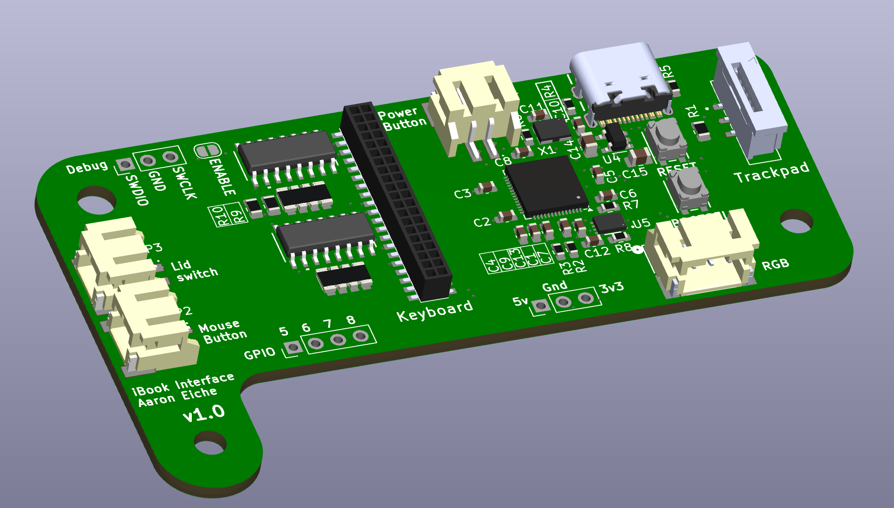

# iBook Keyboard & Trackpad adapter

This board is a controller to drive a keyboard and trackpad on an Apple Clamshell iBook G3 - the original iBooks.

### Huh?

Yeah, I'm in the process of making an iBook chassis into a modern computer, and this is the first step. You can find more information (and progress) on this project at the [project page on my website](https://aaroneiche.com/projects/pibook).

### What are the JST connectors for?
Eventually I hope to integrate the controls for the Power button, trackpad button, and the lid-closed sensor (a magnetic *reed switch*). I haven't gotten to that yet, so for right now, they're just connectors that go to GPIO on the RP2040.

The RGB out is something where I'm hoping to support RGB LEDs to pass through the keyboard for fun. This is a "bells and whistles" type thing, and might not ever get addressed.

### Can I use it?
Yes, you can. But please be aware that I haven't finalized the design and I'm not sure that it'll work 100% yet. Also, the firmware is in an incomplete state (and not included in this repo yet), so *caveat emptor*. That said, if you have questions feel free to send me a message. I'm happy to help where I can.

